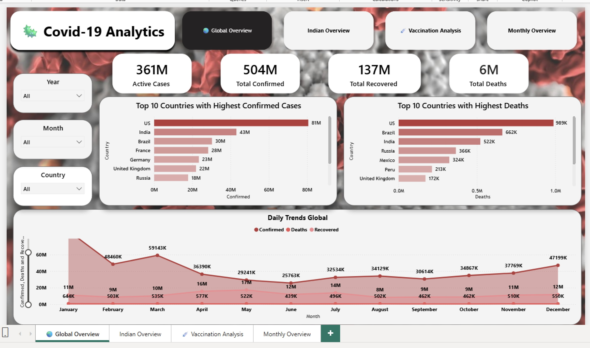
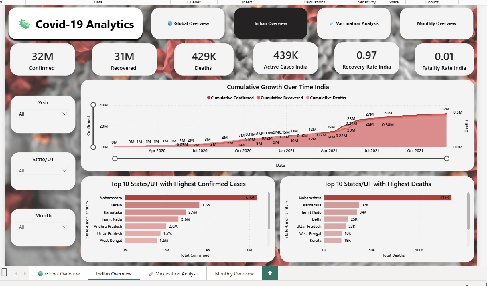
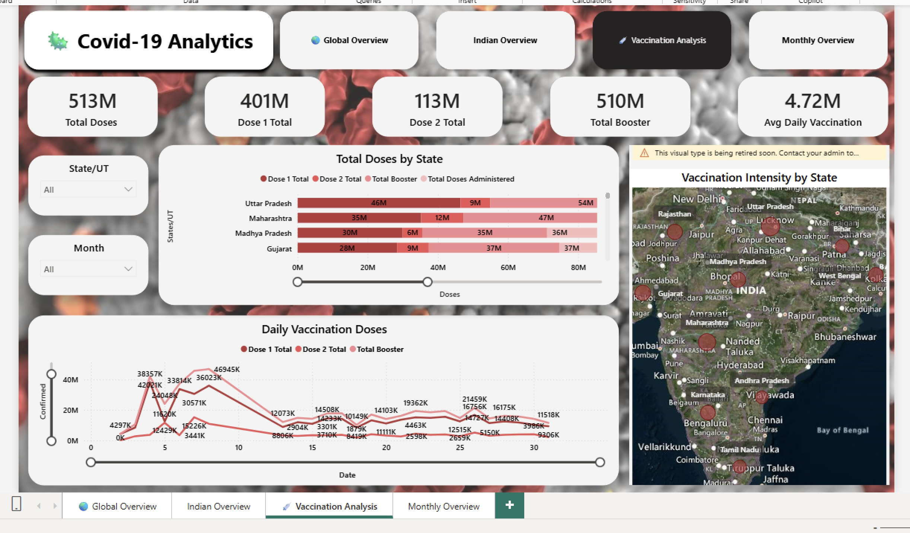
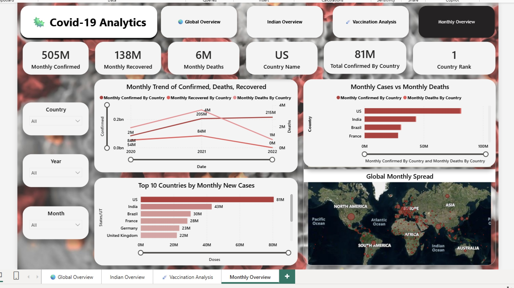

# 🎨COVID-19 Analytics Dashboard (Power BI / Excel)

An end-to-end data analytics project analyzing the global and India-specific impact of COVID-19 using Power BI and Excel.

📂 Project Structure
```text
Covid-19-Analytics/
│
├── data/
│   ├── raw/
│   │   ├── Country_wise_daily_new_cases.csv
│   │   ├── covid_19_india_daily_new_cases.csv
│   │   ├── covid_19_india_daily_new_Test_cases.csv
│   │   ├── covid_vaccine_statewise_daily_new_selected.csv
│   │   ├── india_gdp_loss_covid_simulated.csv
│   │
│   ├── processed/
│   │   ├── covid_19_india_monthly_report.csv
│   │   ├── monthly_new_by_country.csv
│
├── PowerBI/
│   ├── Covid_19_Analytics.pbix
│
├── docs/
│   ├── screenshots/
│   │   ├── global_overview.png
│   │   ├── india_overview.png
│   │   ├── vaccination_analysis.png
│   │   ├── monthly_overview.png
│   │   ├── economic_impact.png
│   │
│   ├── data_dictionary.md
│   ├── project_report.md
│
├── README.md
├── LICENSE
├── .gitignore
```

## 📊 Project Overview
This dashboard provides insights into:
- Global and India COVID-19 case trends
- Daily and monthly confirmed, recovered, and death cases
- Vaccination progress (Dose 1, Dose 2, Booster)
- Country and state-wise comparisons
- Monthly global trends and rankings
- Economic impact of COVID-19 using GDP indicators

## 🛠 Tools Used
- Power BI (Data Modeling, DAX, Visualization)
- Microsoft Excel (Data Cleaning & Preparation)
- Git & GitHub (Version Control)

## 📁 Dataset Details
- Global daily COVID-19 cases
- India state-wise daily cases
- Vaccination state-wise data
- Simulated GDP impact data

## 📌 Key Features
- Dynamic KPIs with time intelligence
- Custom slicers (Year, Month, Country, State, Dose Type)
- Global vs Country comparison
- Weekly and monthly trend analysis
- Clean star-schema data model

## 📷 Dashboard Preview

### 🌍 Global Overview


### 🇮🇳 India Overview


### 💉 Vaccination Analysis


### 📅 Monthly Global & Country Comparison

Screenshots are available in the `docs/screenshots` folder.

## 🚀 How to Use
1. Download the `.pbix` file from the PowerBI folder
2. Open in Power BI Desktop
3. Refresh data (if source paths are updated)

## 📈 Future Scope
- Real-time data integration
- Predictive modeling
- Automated refresh pipelines

## 🙌 Acknowledgements
This project is dedicated to healthcare workers and researchers worldwide.
